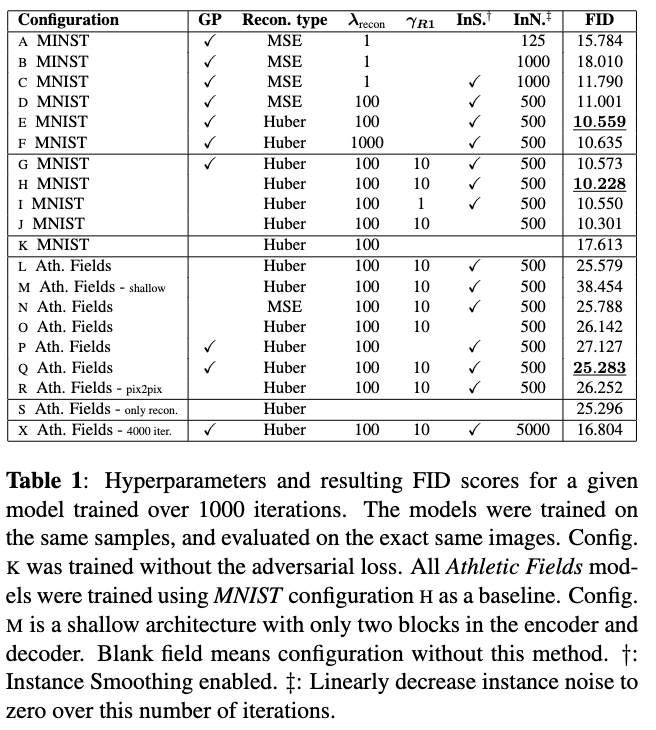

## About
This repository is a placeholder for me to showcase the work done in the course: Introduction to Intelligent Systems, 02461 at The Technical University of Denmark.
The jupiter notebook is added, howver the commit history does NOT portray who did what in regards to coding.
Please read the report for the table of responsebillities regarding the report. 

## Abstract
Restoring grayscale images, especially historically significant black and white photographs, has been a labor-intensive task requiring manual intervention. The pursuit of automating this process has led to a competitive landscape in the field of machine learning. Specialized models have been developed for specific tasks, limiting scalability. In this project, we explore the potential of adversarial networks for colorization across datasets of increasing complexity. Our implementation involves a UNet with Instance Normalization, combined with adversarial Wasserstein loss, R1 Regularization, and Instance Noise. We introduce a novel technique, Instance Smoothing, inspired by Label Smoothing, to enhance training stability. Our experiments demonstrate the model's adaptability to datasets of varying complexities, highlighting the architecture's robustness and performance scalability. The achieved Fréchet Inception Distance (FID) of 16.804 on the Athletic Fields category of the Places 365 dataset underscores the model's effectiveness. Adversarial networks exhibit immense promise, yielding superior outcomes even during extended training, without succumbing to the brownish tinge issue associated with simpler Mean Squared Error (MSE) loss methods.

## Authors
* Kristian Friis Nielsen (s204120)
* Mads Andersen (s204137)
* Iván Viemoes Cuevas (s205823)
* Anders Nørskov (s183995)

## Features
Colorization of grayscale images using a UNet architecture with Instance Normalization.
Adversarial training with Wasserstein loss and R1 Regularization.
Incorporation of Instance Noise and novel Instance Smoothing technique.
Scalability demonstrated across datasets of varying complexities.
Achieved FID of 16.804 on the Athletic Fields category of the Places 365 dataset.
Effective colorization without the brownish tinge issue of MSE-based methods.

## Main results

